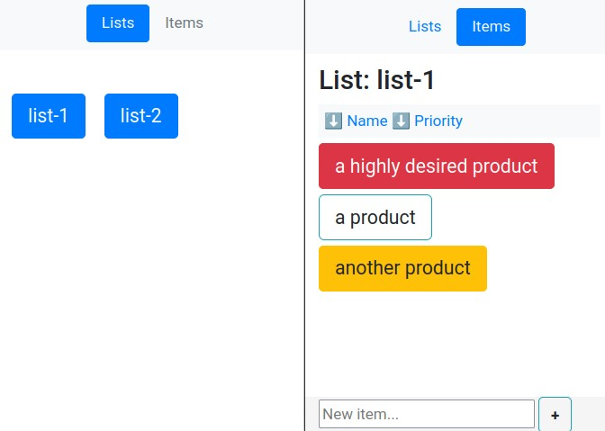

Shopping Lists
==============

A small web application to manage shopping lists. 

Very simple, file-based, designed to be mobile-first, although easy to use also from a computer.

## General Instructions

- Tweak `config.py` according to your preferences
- To create a new list you must manually create an empty txt file inside your configured data folder. The name without extension will become the name of the list
- To edit a list, just click it from the lists view and you will enter the items view
- Once viewing items, click/tap them one or more times to cycle their state to:
    - `Grey`: No need to buy right now ("unchecked")
    - `Yellow`: Need to buy ("checked")
    - `Red`: Important to buy ("highlighted")
    - `Black`: Remove from list. Will disappear upon changing list or reloading, except if you tap and change its state again
- You can also create new items from the item view at the bottom, just fill the textbox with the item name and press the `+` button

Status cycles: `Unchecked` -> `Checked` -> `Highlighted` -> `Deleted` -> (cycle restarts, `Unchecked` again)

### Multi-Line Mode

Lists whose filename starts with the configured prefix (default: `multi-`) automatically enable multi-line mode:
- Multi-line input (ENTER adds new lines instead of submitting)
- Items display with left alignment
- Markdown rendering for formatted content
- File upload support (configurable max size, auto-deletion on item removal)

Example: Create a file named `multi-groceries.txt` to have a multi-line enabled grocery list.

## Development

Just run `make run` and it will tell you the url to access the development version once the container is ready.

### CSS

CSS stylesheet used is [Bootstrap](https://getbootstrap.com/) with tiny tweaks, and most importantly, with all unused CSS removed via [PurgeCSS](https://purgecss.com/CLI.html). Kept the original full css file (in `static/style.original.css`) but unused from the templates.

## Deployment

**Beware of default config values, make sure to change them**. That said, up to you how to deploy it.
